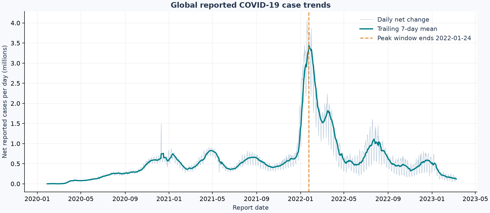

# COVID-19 Trend Analysis

**Python · pandas · Matplotlib | Historical data exploration**

When did reported COVID-19 cases peak, and how did the shape of reporting differ
across countries and regions? This project converts a wide cumulative case table
into an auditable daily analysis, retaining reporting corrections explicitly.



## Measured results

| Measure | Result |
|---|---:|
| Source geographic rows | 289 |
| Source daily case cells reshaped | 330,327 |
| Analysed country/region-day records | 227,457 |
| Countries and regions, excluding two ship categories | 199 |
| Reporting period | 2020-01-22 to 2023-03-09 |
| Negative country-day reporting revisions retained | 171 |
| Largest global trailing seven-day average | 3,436,897 net reported cases/day |
| Peak seven-day window ending | 2022-01-24 |

The source has 289 wide geographic rows, not 227,457 independent patients or
raw input rows. The larger number is the country-day table after aggregation and
reshaping. The global peak is a reporting peak; it cannot identify infection dates.

## Method

1. Verify the archived Johns Hopkins source file against its recorded hash.
2. Validate country labels, geographic uniqueness, numeric counts and contiguous dates.
3. Exclude `Diamond Princess` and `MS Zaandam`; retain all other source country/region labels.
4. Sum provincial cumulative counts within each country/region, then reshape to daily records.
5. Difference cumulative counts. Leave each country's first daily value unknown because
   the previous day's total is unavailable. **Retain negative corrections** rather than
   clipping them to zero or silently deleting them.
6. Calculate a trailing seven-day mean requiring seven known daily differences.
   Identify each country's maximum and the maximum of the summed global series.

No population normalisation, forecasting or causal inference is performed. The
global series is the sum of retained country/region rows, including their revisions.
All 171 negative revisions are exported for inspection.
No cumulative case values are missing in this snapshot.

## Read the outputs

- [`metrics.json`](reports/metrics.json): counts, date range and peak measurement.
- [`global_daily.csv`](reports/global_daily.csv): global totals, differences and rolling mean.
- [`country_peaks.csv`](reports/country_peaks.csv): peak-window ending date for each country.
- [`negative_revisions.csv`](reports/negative_revisions.csv): every negative country-day change.
- [`country_comparison.png`](reports/country_comparison.png): six largest final reported totals,
  with independent vertical scales to show timing rather than comparative risk.
- `data/processed/country_daily.csv`: regenerated full tidy table, excluded from Git.

## Interpretation and limitations

The largest global reporting window ends on **24 January 2022**. The US peak window
ends on 15 January 2022, while India's ends on 8 May 2021 in this snapshot. These
different timings are descriptive observations, not evidence of policy effectiveness.

Testing access, definitions, delayed batches, backfills and incomplete reporting
change across places and time. Seven-day averaging reduces weekday noise but does
not fix reporting bias. Retaining net corrections preserves reconciliation with
cumulative totals, but a correction can distort a rolling window. Counts are not
population-adjusted and should not be used to rank infection risk. Country names
and geographic categories follow the source and are not a geopolitical standard.
The archive ends in March 2023 and does not describe current conditions.

## Data and attribution

Source: [Johns Hopkins CSSE COVID-19 repository](https://github.com/CSSEGISandData/COVID-19),
global confirmed-case time series. The download is pinned to the commit in
[`data/sources.json`](data/sources.json). Source reporting ceased in March 2023.
Consult the source repository's terms before reusing or redistributing its data.

Citation: Dong E, Du H, Gardner L. *An interactive web-based dashboard to track
COVID-19 in real time*. The Lancet Infectious Diseases (2020).
[DOI: 10.1016/S1473-3099(20)30120-1](https://doi.org/10.1016/S1473-3099(20)30120-1).

## CV wording supported by this run

> Built a reproducible pandas/Matplotlib pipeline analysing 227,457 COVID-19
> country-day records across 199 countries and regions; identified peak reported
> case periods and audited 171 negative reporting revisions.

## Next investigation

Add a versioned population source for per-capita comparisons, compare alternative
revision-handling approaches, and test sensitivity of peaks to reporting backlogs.

## Run it locally

Use **Python 3.12**. From this repository's root:

```bash
python -m venv .venv
```

Activate it in Windows PowerShell with `.venv\Scripts\Activate.ps1`,
or on macOS/Linux with `source .venv/bin/activate`.
If PowerShell blocks activation, use `.venv\Scripts\python.exe` in place of `python`.

```bash
python -m pip install -r requirements.txt
python -m src.analysis
```

The first run downloads the public source files and checks their SHA-256 hashes.
Later runs use `data/raw/`. A changed source causes an explicit error rather than
silently changing the reported results. Delete a corrupted local cache file and retry;
if upstream bytes changed, review the data and update the manifest deliberately.

### Notebook and tests

```bash
python -m pip install -r requirements-dev.txt
python -m pytest -q
```

Open `notebooks/analysis.ipynb` in VS Code with the Jupyter extension and select
your `.venv` Python interpreter, or open it in an existing Jupyter installation.
The committed notebook contains executed outputs and can be viewed directly on GitHub.
It reruns the same pipeline, then explains its evidence. It works from the root or
the `notebooks` directory. No separate notebook-only implementation is maintained.

## Repository map

```text
src/                  Reusable analysis and command-line entry point
notebooks/            Executed, narrated walkthrough
data/sources.json     Exact source URLs, file sizes and SHA-256 hashes
reports/              Measured results, prediction tables and figures
tests/                Offline checks for data handling and metric integrity
.github/workflows/    Automated tests on push and pull request
requirements.txt      Exact versions of direct runtime dependencies
requirements-dev.txt  Runtime dependencies plus notebook and test tools
```

`reports/metrics.json` is the result of a real run, not a target or invented score.
`reports/run_metadata.json` records the execution time, Python and library versions,
and data provenance. Re-running updates generated reports. Direct dependencies are
pinned; transitive dependency resolution may differ on future installs.

## Scope and licensing

This is an educational portfolio project. Source code is provided under the MIT
license in `LICENSE`; that license does **not** relicense third-party datasets.
Raw source data are excluded from Git and from the downloadable repository archive.
